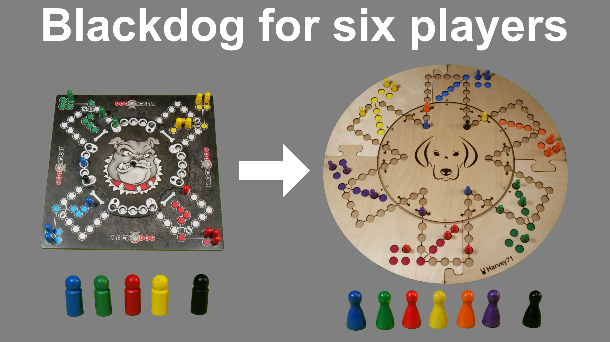

# Blackdog board game for six players

I really love the board game "Blackdog". Unfortunately, the game is limited to four players and it is so more fun with six.

So I created a neat six player addon using my Snapmaker laser cutter.

If you want to recreate it, please watch my video on youTube: https://youtu.be/U4oRDHJKkVw

If you own a Snapmaker laser cutter, you can start directly with the Luban files in the "cam" directory.
If you own another laser cutter or prefer LightBurn over Luban, then you can use the SVN files in the "cad" directory.

Please note that you still need the original four player game. I deliberately do not provide templates for the
cards or the manual, since I do not want to damage the original manufacturer. This is a source for an addon, which is
currently (2022) not available for sale. BTW: If you follow the video, then you will come with a compound variant for
four and six players in one box. :-)

Nevertheless, I think my version is also an improvement in appearance and handling. For example, I use small magnets,
so that the turntable will snap into one of the six correct positions. Also, the pieces will not have to slide/scratch
over the baseplate, since I added an extra sliding foil to the turntable.

Parts list:

| article | quantity | example order link* |
|----------|---------|--------------------|
| original game | 1 | https://www.amazon.de/gp/product/B01HRYA47U |
| MDF 5mm, 300x300mm |  4 pcs | hardware store |
| basswood 3mm A3 | 3 pcs | https://www.amazon.de/gp/product/B078W5MLT4 (10 pcs) |
| game pieces 24x12mm | 4 sets | https://www.amazon.de/gp/product/B0088I7Y96 (10 sets) |
| foil 0,3mm A3 | 1 pcs | https://www.amazon.de/gp/product/B08961ZN3Q (5 pcs) |
/ brass pipe ∅6mm | 9mm | hardware store |
| foam foil bags 30x30cm | 5 pcs | https://www.amazon.de/gp/product/B09S6CVXZP (50 pcs) |
| acrylic paint set | 1 | https://www.amazon.de/gp/product/B00IA1RSHO |
| neodynium magnets 3x2mm | 6 | https://www.amazon.de/gp/product/B07JHT1B9W (50 pcs) |
| headless screws M4x4mm | 6 | https://www.amazon.de/gp/product/B093ML12KY (20 pcs) |
| Snapmaker A350T with 10W laser module ;-) | 1 | https://eu.snapmaker.com |

*: These are not affiliate links, so I do not benefit from you clicking them. They are example links from
Amazon Germany, but feel free to buy anywhere else.

You also need wood glue, super glue, plastic glue, some sandpaper, denatured alcohol and maybe some stuff I forgot to mention.

Have fun recreating and playing.